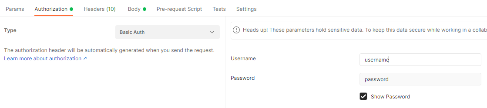
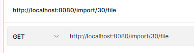
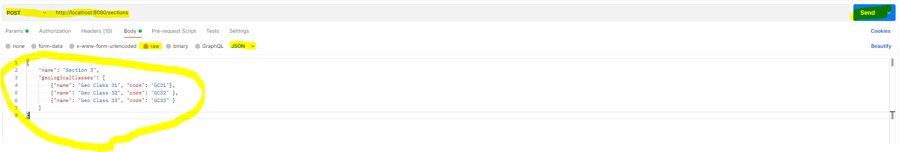
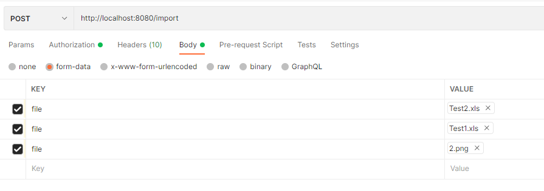

# Test-Task-from-Netlax

Стек: Java 11, PostgreSQL, Hibernate, Spring Security(Basic Auth), Spring Data, Lombok, Apache POI, Jackson, DevTools

Перед запуском:
Создать пустую базу данных PostgreSQL
Скачать проект через Intellij IDEA -> File -> New -> Project from Version Control -> URL = https://github.com/VadimZineev/Test-Task-from-Netlax.git
В файле src/main/resources/hibernate.properties редактировать строки url, username, password для подключение к БД.
Параметр hbm2ddl.auto выставлен на create, после первого запуска hibernate создаст все необходимые таблицы 
и после этого, данную строку можно закомментировать, иначе таблицы будут пересоздаваться при каждом следующем запуске. 

В файле src/main/resources/application.properties можно изменить размер загружаемого файла

Проверить работоспособность удобнее всего через программу Postman
Перед отправкой любого запроса, необходимо будет указать во вкладке Authorization
Basic Auth, Username = username, Password = password

Для отправки GET-запросов выбрать метод GET, добавить ссылку и нажать SEND

Для отправки POST-запросов выбрать метод POST -> Добавить ссылку -> Body -> row -> правее поменять Text на Json -> Скопировать JSON -> SEND

Для отправки файлов выбрать метод POST -> Добавить ссылку -> Body -> form-data -> key=file -> в той же ячейке поменять Text на File -> value(нажать Select и выбрать файл) Можно выбрать несколько файлов

В папке src/main/resources/files - находятся файлы для проверки работы.

Список всех запросов:

POST http://localhost:8080/sections
###
GET http://localhost:8080/sections
###
PUT http://localhost:8080/sections
###
DELETE http://localhost:8080/sections
###
GET http://localhost:8080/sections/by-code?code={code}

Файлы:
###
POST http://localhost:8080/import
###
GET http://localhost:8080/import?id={id}
###
GET http://localhost:8080/export
###
GET http://localhost:8080/export/{{id}}
###
GET http://localhost:8080/export/{{id}}/file

